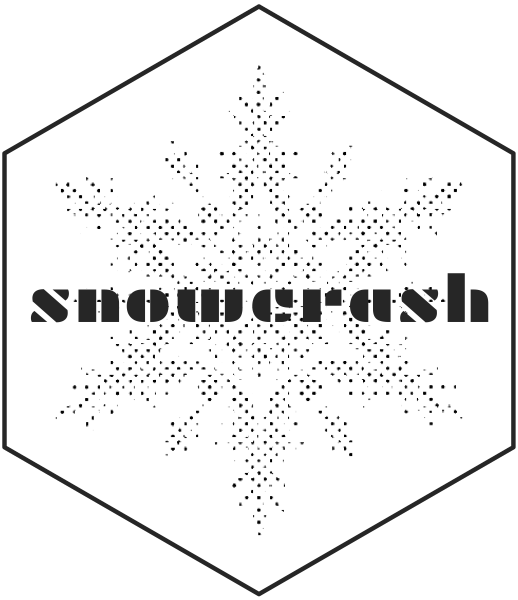

<!-- README.md is generated from README.Rmd. Please edit that file -->

```{r, include = FALSE}
knitr::opts_chunk$set(
  collapse = FALSE,
  comment = "#>",
  fig.path = "man/figures/README-",
  out.width = "100%"
)

library(ggplot2)
library(snowcrash)
```


```{r echo = FALSE, eval = FALSE}
# Quick logo generation. Borrowed heavily from Nick Tierney's Syn logo process
library(magick)
library(showtext)
font_add_google("Plaster", "gf")


# pkgdown::build_site(override = list(destination = "../coolbutuseless.github.io/package/devout"))
```


```{r echo = FALSE, eval = FALSE}
img <- image_read("man/figures/snowflake.png")


hexSticker::sticker(subplot  = img,
                    s_x      = 1.0,
                    s_y      = 1.0,
                    s_width  = 1.7,
                    s_height = 1.7,
                    package  = "snowcrash",
                    p_x      = 1,
                    p_y      = 1,
                    p_color  = "#333333",
                    p_family = "gf",
                    p_size   = 5.5,
                    h_size   = 0.5,
                    h_fill   = "#ffffff",
                    h_color  = "grey20",
                    filename = "man/figures/logo.png")

image_read("man/figures/logo.png")
```


# snowcrash   

<!-- badges: start -->

[](https://www.tidyverse.org/lifecycle/#experimental)
<!-- badges: end -->

`snowcrash` is a package for encoding arbitrary R objects as rasters, PNGs 
and rasterGrobs.


#### Why?

Although this may seem like a frivolous package, encoding data as images is 
one way to transmit information to a graphics device through an otherwise impenetrable
barrier.  This package is needed to enable extra data to pass to a graphics
device when using devices based upon [devout](https://github.com/coolbutuseless/devout).


## What's in the box

* `encode_robj_to_bytes()`/`decode_bytes_to_robj` encode an arbitrary R object to bytes using `base::serialize()`.
  This will also compress the data if [zstdlite](https://github.com/coolbutuseless/zstdlite)
  is installed.
* `encode_robj_to_png()`/`decode_png_to_robj` encode an arbitrary R object as a png
* `encode_robj_to_raster()`/`decode_raster_to_robj` encode as a raster image
* `encode_robj_to_rasterGrob()`/`decode_rasterGrob_to_robj()` encode as a `grid::rasterGrob()` object

## Installation

You can install from [GitHub](https://github.com/coolbutuseless/snowcrash) with:

``` r
# install.package('remotes')
remotes::install_github('coolbutuseless/zstdlite') # suggested. but not mandatory.
remotes::install_github('coolbutuseless/snowcrash')
```


## Encoding a small vector as bytes

```{r}
bytes <- encode_robj_to_bytes(c(1, 2, 3))
bytes
decode_bytes_to_robj(bytes)
```


## Encoding a `data.frame` as an Image Raster

This example encodes the head of the `mtcars` data.frame into a raster image.

```{r}
ras <- encode_robj_to_raster(head(mtcars), alpha = 1)
head(ras)
plot(ras, interpolate = FALSE)
decode_raster_to_robj(ras)
```


## Encoding a Function as a `grid::rasterGrob()`

This example encodes the `rle()` function into a `rasterGrob()` object.

```{r out.width="50%"}
raster_grob <- encode_robj_to_rasterGrob(rle, alpha = 1)
grid::grid.draw(raster_grob)
decode_rasterGrob_to_robj(raster_grob)
```


## Encoding a `ggplot2` Object as a PNG image

This example encodes a full `ggplot` code object in a PNG image file.

```{r}
#~~~~~~~~~~~~~~~~~~~~~~~~~~~~~~~~~~~~~~~~~~~~~~~~~~~~~~~~~~~~~~~~~~~~~~~~~~~~~
# Create a plot ojbect
#~~~~~~~~~~~~~~~~~~~~~~~~~~~~~~~~~~~~~~~~~~~~~~~~~~~~~~~~~~~~~~~~~~~~~~~~~~~~~
library(ggplot2)
p <- ggplot(mtcars) + 
  geom_point(aes(mpg, wt))


#~~~~~~~~~~~~~~~~~~~~~~~~~~~~~~~~~~~~~~~~~~~~~~~~~~~~~~~~~~~~~~~~~~~~~~~~~~~~~
# Save the ggplot2 object as a PNG image
#~~~~~~~~~~~~~~~~~~~~~~~~~~~~~~~~~~~~~~~~~~~~~~~~~~~~~~~~~~~~~~~~~~~~~~~~~~~~~
encode_robj_to_png(p, filename = "man/figures/test.png", alpha = 1)
```


```{r}
p <- decode_png_to_robj('man/figures/test.png') 

p + 
  theme_bw() + 
  labs(title = "Decoded plot object")
```


## `snowcrash` - by Neal Stephenson

This package is named after [Snow Crash](https://en.wikipedia.org/wiki/Snow_Crash),
a sci-fi book by Neal Stephenson where events are set in motion by someone viewing an image 
of encoded information. 

> "You saw the whole thing," Da5id says. "A fixed pattern of black-and-white pixels, fairly high-resolution. Just a few hundred thousand ones and zeroes for me to look at."
>
> "So in other words, someone just exposed your optic nerve to what, maybe a hundred thousand bytes of information," Hiro says.
>
> "Noise, is more like it."
>
> "Well, all information looks like noise until you break the code," Hiro says.
>
> "Why would anyone show me information in binary code? I'm not a computer. I can't read a bitmap."


## Related Software

* `base::serialize()` and `base::unserialize()` are the built-in functions for
serializing/unserializing any R object.  These functions are used internally
in `{snowcrash}`


## Acknowledgements

* R Core for developing and maintaining the language.
* CRAN maintainers, for patiently shepherding packages onto CRAN and maintaining
  the repository
