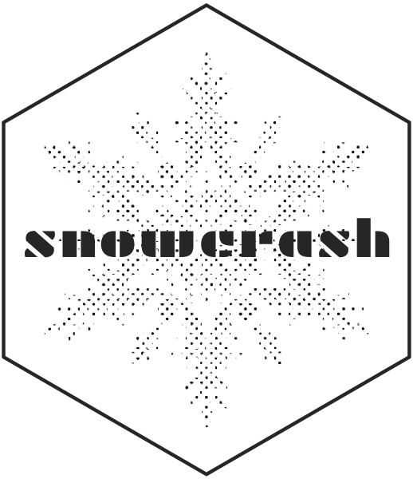
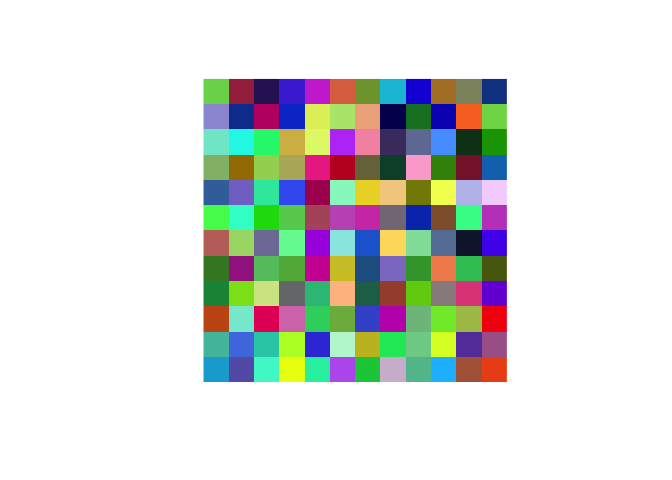
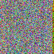

<!-- README.md is generated from README.Rmd. Please edit that file -->

# snowcrash 

<!-- badges: start -->

 [](https://www.tidyverse.org/lifecycle/#experimental)
[](https://github.com/coolbutuseless/snowcrash/actions)
<!-- badges: end -->

`snowcrash` is a package for encoding arbitrary R objects as rasters,
PNGs and rasterGrobs.

#### Why?

Although this may seem like a frivolous package, encoding data as images
is one way to transmit information to a graphics device through an
otherwise impenetrable barrier. This package is needed to enable extra
data to pass to a graphics device when using devices based upon
[devout](https://github.com/coolbutuseless/devout).

## What’s in the box

  - `encode_robj_to_bytes()`/`decode_bytes_to_robj` encode an arbitrary
    R object to bytes using `base::serialize()` and
    `base::memCompress()`
  - `encode_robj_to_png()`/`decode_png_to_robj` encode an arbitrary R
    object as a png
  - `encode_robj_to_raster()`/`decode_raster_to_robj` encode as a raster
    image
  - `encode_robj_to_rasterGrob()`/`decode_rasterGrob_to_robj()` encode
    as a `grid::rasterGrob()` object

## Installation

You can install from
[GitHub](https://github.com/coolbutuseless/snowcrash) with:

``` r
# install.package('remotes')
remotes::install_github('coolbutuseless/snowcrash')
```

## Encoding a small vector as bytes

``` r
bytes <- encode_robj_to_bytes(c(1, 2, 3))
bytes
```

    #>  [1] 78 9c 73 e2 62 66 60 60 60 62 60 61 60 60 65 66 60 05 b2 43 43 dc 74 2d f8
    #> [26] 80 0c 90 04 04 7c b0 87 32 1c 20 14 87 03 00 5c f8 03 7f

``` r
decode_bytes_to_robj(bytes)
```

    #> [1] 1 2 3

## Encoding a `data.frame` as an Image Raster

This example encodes the head of the `mtcars` data.frame into a raster
image.

``` r
ras <- encode_robj_to_raster(head(mtcars), alpha = 1)
head(ras)
```

    #>      [,1]        [,2]        [,3]        [,4]        [,5]        [,6]       
    #> [1,] "#78D65AFF" "#A42E4CFF" "#311C63FF" "#4937D7FF" "#CC3DD5FF" "#DF7350FF"
    #> [2,] "#9C9AD7FF" "#103F9DFF" "#BE1E71FF" "#0A3FCFFF" "#E2EE68FF" "#B5E779FF"
    #> [3,] "#7DE8CFFF" "#11F6E5FF" "#18F47AFF" "#D4BA54FF" "#E2F676FF" "#BD49F7FF"
    #> [4,] "#92BB78FF" "#A37C01FF" "#A2D561FF" "#B6B36AFF" "#EC3792FF" "#C20228FF"
    #> [5,] "#3D72AAFF" "#8376CCFF" "#2EE8AAFF" "#4061F0FF" "#AC015EFF" "#95F6C7FF"
    #> [6,] "#4CF75CFF" "#2EFFCFFF" "#0EDB0AFF" "#64CF5CFF" "#B3586BFF" "#C45CC0FF"
    #>      [,7]        [,8]        [,9]        [,10]       [,11]       [,12]      
    #> [1,] "#7FA23AFF" "#09C0D8FF" "#1817DAFF" "#B17F2DFF" "#8C916DFF" "#164393FF"
    #> [2,] "#EFAF8AFF" "#05055DFF" "#167F2AFF" "#0C10BBFF" "#F97329FF" "#7DD855FF"
    #> [3,] "#F595B0FF" "#493B6DFF" "#717CA3FF" "#55A2FFFF" "#0C3D1AFF" "#15A003FF"
    #> [4,] "#787248FF" "#084E35FF" "#FCADD3FF" "#3B8F09FF" "#881E35FF" "#1075BBFF"
    #> [5,] "#EBD62DFF" "#F3CF8DFF" "#858903FF" "#F2FF5CFF" "#BEC0EDFF" "#F5D5FDFF"
    #> [6,] "#D143B3FF" "#837A86FF" "#093ABAFF" "#905F38FF" "#39F996FF" "#C44CC5FF"

``` r
plot(ras, interpolate = FALSE)
```



``` r
decode_raster_to_robj(ras)
```

    #>                    mpg cyl disp  hp drat    wt  qsec vs am gear carb
    #> Mazda RX4         21.0   6  160 110 3.90 2.620 16.46  0  1    4    4
    #> Mazda RX4 Wag     21.0   6  160 110 3.90 2.875 17.02  0  1    4    4
    #> Datsun 710        22.8   4  108  93 3.85 2.320 18.61  1  1    4    1
    #> Hornet 4 Drive    21.4   6  258 110 3.08 3.215 19.44  1  0    3    1
    #> Hornet Sportabout 18.7   8  360 175 3.15 3.440 17.02  0  0    3    2
    #> Valiant           18.1   6  225 105 2.76 3.460 20.22  1  0    3    1

## Encoding a Function as a `grid::rasterGrob()`

This example encodes the `rle()` function into a `rasterGrob()` object.

``` r
raster_grob <- encode_robj_to_rasterGrob(rle, alpha = 1)
grid::grid.draw(raster_grob)
```


``` r
decode_rasterGrob_to_robj(raster_grob)
```

    #> function (x) 
    #> {
    #>     if (!is.vector(x) && !is.list(x)) 
    #>         stop("'x' must be a vector of an atomic type")
    #>     n <- length(x)
    #>     if (n == 0L) 
    #>         return(structure(list(lengths = integer(), values = x), 
    #>             class = "rle"))
    #>     y <- x[-1L] != x[-n]
    #>     i <- c(which(y | is.na(y)), n)
    #>     structure(list(lengths = diff(c(0L, i)), values = x[i]), 
    #>         class = "rle")
    #> }
    #> <bytecode: 0x7fc977f3eb98>
    #> <environment: namespace:base>

## Encoding a `ggplot2` Object as a PNG image

This example encodes a full `ggplot` code object in a PNG image file.

``` r
#~~~~~~~~~~~~~~~~~~~~~~~~~~~~~~~~~~~~~~~~~~~~~~~~~~~~~~~~~~~~~~~~~~~~~~~~~~~~~
# Create a plot ojbect
#~~~~~~~~~~~~~~~~~~~~~~~~~~~~~~~~~~~~~~~~~~~~~~~~~~~~~~~~~~~~~~~~~~~~~~~~~~~~~
library(ggplot2)
p <- ggplot(mtcars) + 
  geom_point(aes(mpg, wt))


#~~~~~~~~~~~~~~~~~~~~~~~~~~~~~~~~~~~~~~~~~~~~~~~~~~~~~~~~~~~~~~~~~~~~~~~~~~~~~
# Save the ggplot2 object as a PNG image
#~~~~~~~~~~~~~~~~~~~~~~~~~~~~~~~~~~~~~~~~~~~~~~~~~~~~~~~~~~~~~~~~~~~~~~~~~~~~~
encode_robj_to_png(p, filename = "man/figures/test.png", alpha = 1)
```



``` r
p <- decode_png_to_robj('man/figures/test.png') 

p + 
  theme_bw() + 
  labs(title = "Decoded plot object")
```


## `snowcrash` - by Neal Stephenson

This package is named after [Snow
Crash](https://en.wikipedia.org/wiki/Snow_Crash), a sci-fi book by Neal
Stephenson where events are set in motion by someone viewing an image of
encoded information.

> “You saw the whole thing,” Da5id says. “A fixed pattern of
> black-and-white pixels, fairly high-resolution. Just a few hundred
> thousand ones and zeroes for me to look at.”
> 
> “So in other words, someone just exposed your optic nerve to what,
> maybe a hundred thousand bytes of information,” Hiro says.
> 
> “Noise, is more like it.”
> 
> “Well, all information looks like noise until you break the code,”
> Hiro says.
> 
> “Why would anyone show me information in binary code? I’m not a
> computer. I can’t read a bitmap.”

## Related Software

  - `base::serialize()` and `base::unserialize()` are the built-in
    functions for serializing/unserializing any R object. These
    functions are used internally in `{snowcrash}`

## Acknowledgements

  - R Core for developing and maintaining the language.
  - CRAN maintainers, for patiently shepherding packages onto CRAN and
    maintaining the repository
