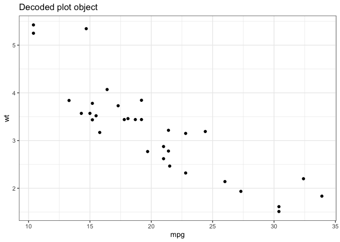

<!-- README.md is generated from README.Rmd. Please edit that file -->

# snowcrash 

<!-- badges: start -->

 [](https://www.tidyverse.org/lifecycle/#experimental)
[](https://github.com/coolbutuseless/snowcrash/actions)
<!-- badges: end -->

`snowcrash` is a package for encoding arbitrary R objects as rasters,
PNGs and rasterGrobs.

#### Why?

Although this may seem like a frivolous package, encoding data as images
is one way to transmit information to a graphics device through an
otherwise impenetrable barrier. This package is needed to enable extra
data to pass to a graphics device when using devices based upon
[devout](https://github.com/coolbutuseless/devout).

## What’s in the box

  - `encode_robj_to_bytes()`/`decode_bytes_to_robj` encode an arbitrary
    R object to bytes using `base::serialize()`. This will also compress
    the data if [zstdlite](https://github.com/coolbutuseless/zstdlite)
    is installed.
  - `encode_robj_to_png()`/`decode_png_to_robj` encode an arbitrary R
    object as a png
  - `encode_robj_to_raster()`/`decode_raster_to_robj` encode as a raster
    image
  - `encode_robj_to_rasterGrob()`/`decode_rasterGrob_to_robj()` encode
    as a `grid::rasterGrob()` object

## Installation

You can install from
[GitHub](https://github.com/coolbutuseless/snowcrash) with:

``` r
# install.package('remotes')
remotes::install_github('coolbutuseless/zstdlite') # suggested. but not mandatory.
remotes::install_github('coolbutuseless/snowcrash')
```

## Encoding a small vector as bytes

``` r
bytes <- encode_robj_to_bytes(c(1, 2, 3))
bytes
```

    #>  [1] 5a 53 54 18 28 b5 2f fd 20 37 a5 01 00 74 02 58 0a 00 00 00 03 00 04 00 02
    #> [26] 00 03 05 00 00 00 00 05 55 54 46 2d 38 00 00 00 0e 3f f0 00 00 40 08 00 00
    #> [51] 00 00 00 00 04 04 01 2b 00 65 dc c4 f3 1c 03

``` r
decode_bytes_to_robj(bytes)
```

    #> [1] 1 2 3

## Encoding a `data.frame` as an Image Raster

This example encodes the head of the `mtcars` data.frame into a raster
image.

``` r
ras <- encode_robj_to_raster(head(mtcars), alpha = 1)
head(ras)
```

    #>      [,1]        [,2]        [,3]        [,4]        [,5]        [,6]       
    #> [1,] "#5A550CFF" "#0064BDFF" "#5260D0FF" "#104EE6FF" "#5EE176FF" "#9D371CFF"
    #> [2,] "#53C640FF" "#364065FF" "#5AD887FF" "#4BE71CFF" "#8C98EBFF" "#9A32C1FF"
    #> [3,] "#543F18FF" "#1341E5FF" "#68CB46FF" "#C1EDF4FF" "#5E92DDFF" "#6C4279FF"
    #> [4,] "#18834BFF" "#4B1695FF" "#B801FFFF" "#304003FF" "#96D4E9FF" "#6C28A9FF"
    #> [5,] "#28392FFF" "#3E0CE2FF" "#A042E3FF" "#62B7B9FF" "#C7939FFF" "#014293FF"
    #> [6,] "#B54CE0FF" "#207639FF" "#C0F068FF" "#8AC390FF" "#16DA0DFF" "#FD4B12FF"
    #>      [,7]        [,8]        [,9]        [,10]       [,11]       [,12]      
    #> [1,] "#24FF9CFF" "#32FEC7FF" "#B8A9D0FF" "#7F886CFF" "#FB2A00FF" "#904700FF"
    #> [2,] "#3CEEF6FF" "#598FA3FF" "#306627FF" "#C7187CFF" "#7F1600FF" "#508100FF"
    #> [3,] "#36DBAEFF" "#D465DBFF" "#688F62FF" "#FF4D3FFF" "#4E0100FF" "#906D00FF"
    #> [4,] "#001585FF" "#23DFA5FF" "#E1C85BFF" "#EFA33BFF" "#7BD600FF" "#3F1100FF"
    #> [5,] "#40FF8EFF" "#8A10A0FF" "#C276E1FF" "#BFBBE6FF" "#F62C00FF" "#131500FF"
    #> [6,] "#00B355FF" "#F6A58AFF" "#A1C042FF" "#84B1DEFF" "#EDA500FF" "#2E5400FF"
    #>      [,13]      
    #> [1,] "#7DA000FF"
    #> [2,] "#DCC800FF"
    #> [3,] "#922500FF"
    #> [4,] "#A8F000FF"
    #> [5,] "#340200FF"
    #> [6,] "#242900FF"

``` r
plot(ras, interpolate = FALSE)
```


``` r
decode_raster_to_robj(ras)
```

    #>                    mpg cyl disp  hp drat    wt  qsec vs am gear carb
    #> Mazda RX4         21.0   6  160 110 3.90 2.620 16.46  0  1    4    4
    #> Mazda RX4 Wag     21.0   6  160 110 3.90 2.875 17.02  0  1    4    4
    #> Datsun 710        22.8   4  108  93 3.85 2.320 18.61  1  1    4    1
    #> Hornet 4 Drive    21.4   6  258 110 3.08 3.215 19.44  1  0    3    1
    #> Hornet Sportabout 18.7   8  360 175 3.15 3.440 17.02  0  0    3    2
    #> Valiant           18.1   6  225 105 2.76 3.460 20.22  1  0    3    1

## Encoding a Function as a `grid::rasterGrob()`

This example encodes the `rle()` function into a `rasterGrob()` object.

``` r
raster_grob <- encode_robj_to_rasterGrob(rle, alpha = 1)
grid::grid.draw(raster_grob)
```


``` r
decode_rasterGrob_to_robj(raster_grob)
```

    #> function (x) 
    #> {
    #>     if (!is.vector(x) && !is.list(x)) 
    #>         stop("'x' must be a vector of an atomic type")
    #>     n <- length(x)
    #>     if (n == 0L) 
    #>         return(structure(list(lengths = integer(), values = x), 
    #>             class = "rle"))
    #>     y <- x[-1L] != x[-n]
    #>     i <- c(which(y | is.na(y)), n)
    #>     structure(list(lengths = diff(c(0L, i)), values = x[i]), 
    #>         class = "rle")
    #> }
    #> <bytecode: 0x7fc64d8cd350>
    #> <environment: namespace:base>

## Encoding a `ggplot2` Object as a PNG image

This example encodes a full `ggplot` code object in a PNG image file.

``` r
#~~~~~~~~~~~~~~~~~~~~~~~~~~~~~~~~~~~~~~~~~~~~~~~~~~~~~~~~~~~~~~~~~~~~~~~~~~~~~
# Create a plot ojbect
#~~~~~~~~~~~~~~~~~~~~~~~~~~~~~~~~~~~~~~~~~~~~~~~~~~~~~~~~~~~~~~~~~~~~~~~~~~~~~
library(ggplot2)
p <- ggplot(mtcars) + 
  geom_point(aes(mpg, wt))


#~~~~~~~~~~~~~~~~~~~~~~~~~~~~~~~~~~~~~~~~~~~~~~~~~~~~~~~~~~~~~~~~~~~~~~~~~~~~~
# Save the ggplot2 object as a PNG image
#~~~~~~~~~~~~~~~~~~~~~~~~~~~~~~~~~~~~~~~~~~~~~~~~~~~~~~~~~~~~~~~~~~~~~~~~~~~~~
encode_robj_to_png(p, filename = "man/figures/test.png", alpha = 1)
```


``` r
p <- decode_png_to_robj('man/figures/test.png') 

p + 
  theme_bw() + 
  labs(title = "Decoded plot object")
```



## `snowcrash` - by Neal Stephenson

This package is named after [Snow
Crash](https://en.wikipedia.org/wiki/Snow_Crash), a sci-fi book by Neal
Stephenson where events are set in motion by someone viewing an image of
encoded information.

> “You saw the whole thing,” Da5id says. “A fixed pattern of
> black-and-white pixels, fairly high-resolution. Just a few hundred
> thousand ones and zeroes for me to look at.”
> 
> “So in other words, someone just exposed your optic nerve to what,
> maybe a hundred thousand bytes of information,” Hiro says.
> 
> “Noise, is more like it.”
> 
> “Well, all information looks like noise until you break the code,”
> Hiro says.
> 
> “Why would anyone show me information in binary code? I’m not a
> computer. I can’t read a bitmap.”

## Related Software

  - `base::serialize()` and `base::unserialize()` are the built-in
    functions for serializing/unserializing any R object. These
    functions are used internally in `{snowcrash}`

## Acknowledgements

  - R Core for developing and maintaining the language.
  - CRAN maintainers, for patiently shepherding packages onto CRAN and
    maintaining the repository
